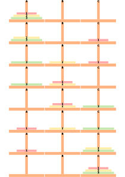

# ЛР \#3: [C++ & UNIX]: C++ CLI / FUNCTION / LOOP / RECURSION

Карсаков Григорий Вячеславович, 3 курс (ФизФ ИТМО), Z33434, 2023

## Цель

Познакомить студента с основными алгоритмическими конструкциями, которые будут
использоваться для создания CLI программы. Далее продемонстрировать
эффективность использования механизма рекурсии.

С++ алгоритмы: CLI Калькулятор вещественных чисел +, -, ^, . Реализация с
использованием только функций, условий, циклов, + и -. Вид команд в консоли: calc
plus / minus / power; Ханойская башня, результат корректной последовательности

## Решение

1. [С++ CLI CALC] Создать программу CALC с интерфейсом CLI.

Создать программу под названием CALC, которая будет принимать на вход 3
аргумента (2 операнда и 1 оператор). Оператор может быть: +, -, ^. Реализация
операторов только с использованием функций, условий, циклов, +, - и *.

Код на C++:

```C++
#include <iostream> //standart
#include <cmath> //for pow()
#include <string.h>

using namespace std;

int main()
{
    std::string s;
    std::cout<<"example:1.23plus4.46\ncommands:plus / minus / power\n";
    std::cout<<"Write a command:";
    std::cin>>s;
    //size_t pos = s.find("plus");
    if (s.find("plus") != std::string::npos)
    {
        size_t pos = s.find("plus");
        double x1 = std::stod(s.substr(0, pos));
        double x2 = std::stod(s.substr(pos+4));
        std::cout<<"="<<x1+x2;
        return 0;
    }
    if (s.find("minus") != std::string::npos)
    {
        size_t pos = s.find("minus");
        double x1 = std::stod(s.substr(0, pos));
        double x2 = std::stod(s.substr(pos+5));
        std::cout<<"="<<x1-x2;
        return 0;
    }
    if (s.find("power") != std::string::npos)
    {
        size_t pos = s.find("power");
        double x1 = std::stod(s.substr(0, pos));
        double x2 = std::stod(s.substr(pos+5));
        std::cout<<"="<<pow(x1, x2);
        return 0;
    }
    return 0;
}
```

2. [C++ RECURSION] Решить задачу ханойской башни с использованием рекурсии.

Описание: Ханойская башня является одной из популярных головоломок XIX века.
Даны три стержня, на один из которых нанизаны восемь колец, причём кольца
отличаются размером и лежат меньшее на большем. Задача состоит в том, чтобы
перенести пирамиду из восьми колец за наименьшее число ходов на другой
стержень. За один раз разрешается переносить только одно кольцо, причём нельзя
класть большее кольцо на меньшее.
Результат обнаруженной последовательности шагов записать в виде двусвязного
списка. В конце программы сделать вывод этого списка на экран. Освободить
память списка перед завершением программы.

Код на C++:

```C++
#include<iostream>
#include<string>
#include<list>

using namespace std;

template<typename T>
void printList(std::list<T> l) {
    for (const auto &item : l) {
        cout << item << "; ";
    }
    cout << endl;
}
  
std::list<string> towerOfHanoi(int n, char from_rod, char to_rod,
                  char aux_rod,std::list<string> list) //функция возвращает список действий
{
    if (n == 0) {
        return list;
    }
    list = towerOfHanoi(n - 1, from_rod, aux_rod, to_rod, list);
    //cout << "Move disk " << n << " from rod " << from_rod
    //     << " to rod " << to_rod << endl;
    string s = to_string(n).append(":");
    s+=from_rod;
    s.append("->");
    s+=to_rod;
    list.push_back(s);
    list = towerOfHanoi(n - 1, aux_rod, to_rod, from_rod, list);
    return list;
}
  
int main()
{
    int N = 8;
    std::list<string> l = {};
    // A, B and C are names of rods
    l = towerOfHanoi(N, 'A', 'C', 'B', l);
    printList(l);
    return 0;
}
```

Пример вывода для n=3:

`1:A->C; 2:A->B; 1:C->B; 3:A->C; 1:B->A; 2:B->C; 1:A->C;`



## Вывод

Я познакомился с основными алгоритмическими конструкциями, которые будут
использоваться для создания CLI программы. Далее продемонстрировать
эффективность использования механизма рекурсии.
