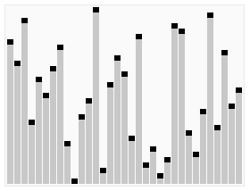

# ЛР #1: Алгоритмы сортировки

## Цель

Познакомить студента с основами анализа алгоритмов на примере операций
сортировки.

**Перечень алгоритмов сортировки**:

- сортировка пузырьком


- сортировка выбором,


- сортировка вставкой,


- сортировка подсчетом,


- цифровая сортировка (LSD, MSD) ,


- сортировка слиянием,


- шейкерная сортировка (сортировка перемешиванием),


- быстрая сортировка (сортировка Хоара),


- сортировка кучей (пирамидальная сортировка).




## Решение

### Сортировка слиянием (merge sort)

#### 1.1 Пример задачи

Нужно упорядочить список файлов на компьютере по размеру, начиная с самых маленьких, используя алгоритм сортировки слиянием для обработки большого количества данных.

#### 1.2 Доказать, что выбранный алгоритм является наилучшим выбором. Привести расчет ёмкостных и вычислительных затрат

Ёмкостные затраты алгоритма сортировки слиянием состоят из использования дополнительной памяти для хранения временных массивов при слиянии. Для сортировки массива размером n потребуется дополнительная память размером n, что делает этот алгоритм менее эффективным по памяти, чем некоторые другие алгоритмы. Однако, если рассматривать случай, когда массив не может поместиться в оперативной памяти целиком, то использование дополнительной памяти становится неизбежным.

Вычислительные затраты алгоритма сортировки слиянием состоят из двух этапов: разбиение массива на меньшие части и слияние отсортированных частей в один отсортированный массив. Разбиение массива на меньшие части происходит за `O(log n)`времени, так как каждый раз массив делится пополам. Слияние отсортированных частей происходит за `O(n)` времени, так как каждый элемент массива рассматривается только один раз при слиянии. Таким образом, общее время работы алгоритма сортировки слиянием составляет `O(n log n)`.

Таким образом, алгоритм сортировки слиянием является наилучшим выбором для сортировки больших массивов данных, которые не могут поместиться в оперативной памяти целиком. Ёмкостные затраты алгоритма состоят из использования дополнительной памяти размером `n`, а вычислительные затраты составляют `O(n log n)`.

#### 1.3 Реализовать алгоритм на языке C++

```C++
void merge(vector<int>& arr, int left, int middle, int right) {
    int n1 = middle - left + 1;
    int n2 = right - middle;

    vector<int> L(n1), R(n2);

    for (int i = 0; i < n1; i++) {
        L[i] = arr[left + i];
    }
    for (int j = 0; j < n2; j++) {
        R[j] = arr[middle + 1 + j];
    }

    int i = 0, j = 0, k = left;

    while (i < n1 && j < n2) {
        if (L[i] <= R[j]) {
            arr[k] = L[i];
            i++;
        }
        else {
            arr[k] = R[j];
            j++;
        }
        k++;
    }

    while (i < n1) {
        arr[k] = L[i];
        i++;
        k++;
    }

    while (j < n2) {
        arr[k] = R[j];
        j++;
        k++;
    }
}
```

### Быстрая сортировка (q sort)

#### 2.1 Пример задачи

Сортировка данных с частично отсортированными подмассивами, где быстрая сортировка может быть более эффективной, чем сортировка слиянием.

Одной из задач, для которой требуется применение алгоритма быстрой сортировки, является сортировка больших массивов данных в базах данных или при работе с большими объемами информации. Например, при сортировке списка клиентов по фамилии или при сортировке товаров по цене в интернет-магазине. Быстрая сортировка может быть более эффективной для таких задач, так как не требует дополнительной памяти и имеет хорошую производительность в среднем случае.

#### 2.2 Доказать, что выбранный алгоритм является наилучшим выбором. Привести расчет ёмкостных и вычислительных затрат

Невозможно доказать, что быстрая сортировка является наилучшим выбором для всех задач сортировки, так как эффективность алгоритма зависит от конкретной задачи и ее параметров (например, размера массива, распределения элементов и т.д.). Однако, быстрая сортировка обычно является одним из наиболее эффективных алгоритмов для сортировки больших массивов данных.

Ёмкостные затраты быстрой сортировки составляют `O(log n)`, так как алгоритм использует рекурсию и требует дополнительной памяти для хранения стека вызовов. Вычислительные затраты зависят от распределения элементов в массиве и могут быть оценены в среднем случае как `O(n log n)`, что является очень хорошей производительностью для больших массивов данных. В худшем случае (например, если массив уже отсортирован или содержит много повторяющихся элементов) вычислительные затраты могут составить `O(n^2)`, что все еще лучше, чем некоторые другие алгоритмы сортировки.

#### 3. Реализовать алгоритм на языке C++

```C++
int partition(vector<int>& arr, int low, int high) {
    int pivot = arr[high];
    int i = low - 1;

    for (int j = low; j <= high - 1; j++) {
        if (arr[j] < pivot) {
            i++;
            swap(arr[i], arr[j]);
        }
    }

    swap(arr[i + 1], arr[high]);
    return i + 1;
}

void quickSort(vector<int>& arr, int low, int high) {
    if (low < high) {
        int pi = partition(arr, low, high);

        quickSort(arr, low, pi - 1);
        quickSort(arr, pi + 1, high);
    }
}
```

## Заключение

**Сортировка слиянием**:

Плюсы:

- Гарантированная вычислительная сложность O(n log n)
- Устойчив к повторяющимся элементам
- Не требует дополнительной памяти для хранения стека вызовов, что делает его более эффективным для обработки больших массивов данных.

Минусы:

- Может потребовать большего количества операций сравнения элементов, чем быстрая сортировка
- Требует дополнительной памяти для хранения временных массивов, что может привести к проблемам с памятью при обработке больших массивов данных.

**Быстрая сортировка**:

Плюсы:

- Очень эффективен для больших массивов данных
- В среднем случае имеет вычислительную сложность O(n log n)
- Хорошо работает на случайных данных

Минусы:

- Худшая вычислительная сложность может достигать O(n^2)
- Неустойчив к повторяющимся элементам
- Требует дополнительной памяти для хранения стека вызовов, что может привести к проблемам с памятью при обработке больших массивов данных.

[сложности алгоритмов](https://neerc.ifmo.ru/wiki/index.php?title=%D0%A1%D0%BE%D1%80%D1%82%D0%B8%D1%80%D0%BE%D0%B2%D0%BA%D0%B8)

## Вопрос: Пример быстрой сортировки

